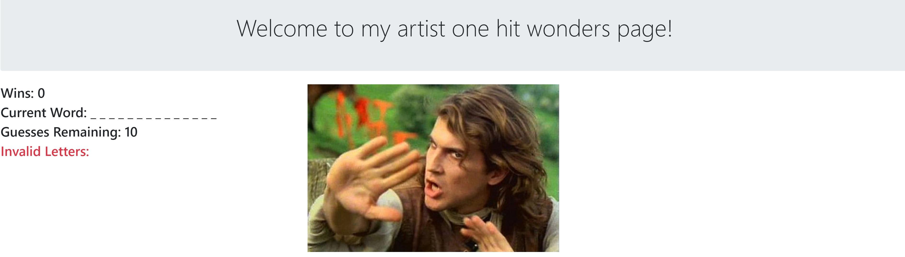
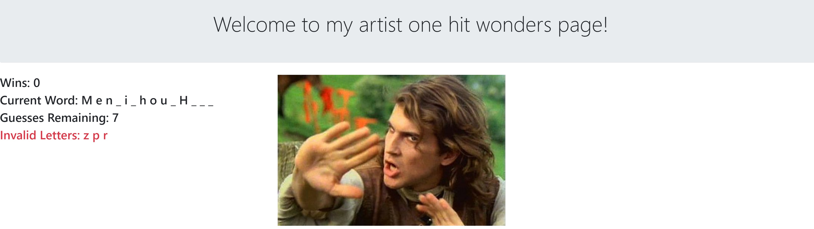
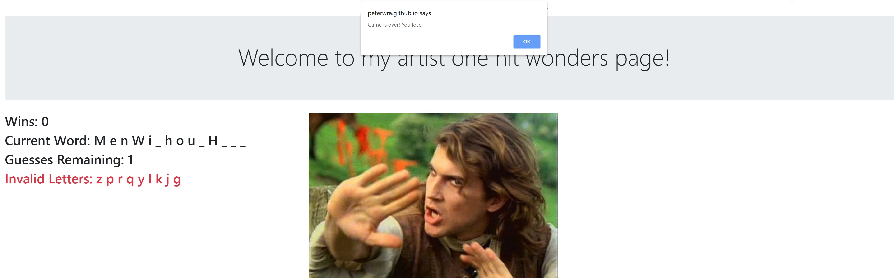
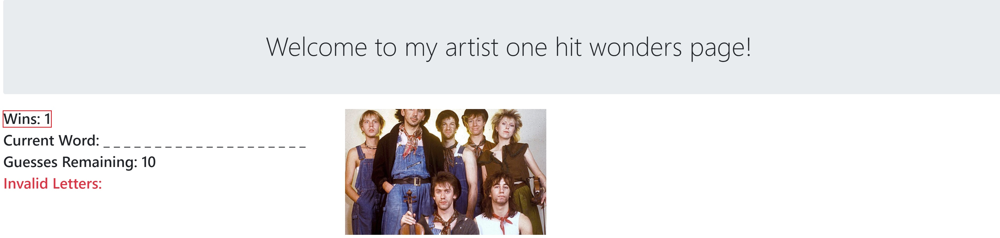

# Word Guess

## External Links

The code repository is stored on GitHub [here](https://github.com/peterwra/Word-Guess-Game).

To access the application, click [here](https://peterwra.github.io/Word-Guess-Game/).

---

## Overview

Everyone loves one hit wonder bands and singers! Can you correctly guess who is in the picture?

---

## Technologies

Bootstrap, jQuery, Javascript

---

## Description

When the application is launched, you will see a page with an artist to guess.

As you correctly guess letters, the underscores will be filled in. Any incorrectly guessed letters are shown in red text.

Too many incorrect guesses and the game will be over!

The current win streak is also displayed and will reset if the artist is not correctly guessed.

